

# ComfyUI-N-Sidebar
A simple sidebar for ComfyUI.
For what i know nobody did it, so i did it.
Maybe you don't need it. I need it >.< 

# Updates

- 08-09-2024
  - Custom shortcuts!

- 04-09-2024
  - Changed the resize system of the n-sidebar (it can now be resized directly from its sides NOTE: the top side wilL only move the bar)
  - Added the ability to directly download CIVITAI models into chosen folders (this includes Checkpoint, Textual Inversion, Hypernetwork, Aesthetic Gradient, LORA, LoCon, DoRA, Controlnet, Upscaler, Motion Module, VAE, Poses, Wildcards, Workflows). [More Info](#assets-downloader).
  - Added the ability to import/export your settings.
  - EXPERIMENTAL: You can now embed ComfyUI's native bar within the n-sidebar
  - EXPERIMENTAL: Added a small console (useful if you don’t have direct access to the machine). If you want to remove this feature, simply delete the `terminal` folder within `ComfyUI-N-Sidebar/app/panels`
  - EXPERIMENTAL: Added the ability to edit the layout of the bar, this functionality is highly unstable and its use may lead to unexpected behaviors
  - Redesigned configuration menu
  - Fixed some bugs

- 01-08-2024
  - A lot of people are having trouble with the CSS class change in the last update because of a browser cache issue: the old CSS file keeps loading from disk instead of the new one with the latest changes (thanks, modern browsers!). To fix this, I've changed the name of the CSS file, which SHOULD force browsers to load the new one. If this doesn't fix the issue, I'm not sure what will 😭.
  - Added the new option `Show at Startup` in the settings. This lets you have the sidebar open at startup (if it's not in fixed mode).
  - Changed the refresh icon so that it displays correctly in Chromium browsers on macOS.
  - Minor change to the CSS

- 30-07-2024
  - Changed the name of the sidebar class to prevent a conflict with the `comfyui-search-navigation` node.

	
Previous Updates

- 21-07-2024
  - Fixed a cache bug on the templates panel

- 19-07-2024
  - Added OSX shortcut support

- 05-07-2024
  - Fixed bug on dragging templates  
  - Added multi user support on templates

- 04-06-2024
  - Fixed some bugs
  - Changed icon bar positioning to the border of the screen
  - Implemented the DAMN subcategory view on the node panel!!! xD (you can disable it in the settings if you don't want it)
  - Added the ability to disable the "Auto Show" feature
  - Added the ability to view folders inside the workflow panel
  - Added some tooltips for better UX
  - Changed the Custom Node Categories icon (I didn't like the old one)
  - Added a little icon in custom categories and folders/subcategories
  - Added the ability to move workflows in custom categories via the context menu
  - Added the ability to open workflows in another TAB

NOTE: If you had some custom categories in the workflow panel, at the first start they will be migrated to the new system (since I did a full rewrite to support the folders). It is possible that you need to refresh the page more than once to see them again. Also, a backup of the settings.json will be created before the migration in case anything goes wrong.

NOTE2: I hope I did not break anything T_T

- 25-05-2024
  - Fixed some bugs
  - Added Templates support**
    - Added ability categorize custom categories
    - Added preview (list of used nodes)
    
  - Added Workflow support!
    - Added ability to rename workflows
    - Added ability to remove workflows
    - Added ability to categorize workflows
    - Added preview (list of used nodes), (disabled by default)

** i did not enabled the **rename** and **delete** because it's conflicing with the TemplateManager

- 21-04-2024
  - Rewritten a lot of the code to improve performance and readability, and slightly adjusted the UI to ensure compatibility with future updates.
  - ADDED CUSTOM CATEGORIES
  - Added custom setting panel
  - Re-Implemented the 'original' search function to support translated versions of ComfyUI (requires testing)
  - Added LEFT and RIGHT positioning options
  - Added "Auto Hide" feature
  - Now you have the option to use the default node ordering in ComfyUI instead of the alphabetical one
  - Added the possibility to perform a Soft or Factory Reset of the configuration
  - Now most configuration settings are stored in the settings.json file.
  - Fixed some bugs
  - Added some other bugs for sure!

- 31-03-2024 
  - Added fuzzy search (work in reverse too!) (enabled by default) -  You can disable it in the settings
  - Added description of the node under the preview (Visible only if the description is set in the node)
  - Added possibility to collapse pinned node/custom nodes sections
  - Added possibility to set the bottom space for the sidebar
  - Added the scroll to top button
  - Fixed some bugs
  - Started migration from cookies to localstorage
  - 🐰 Happy Easter! 🐰

# Installation

1. Clone the repository:
`git clone https://github.com/Nuked88/ComfyUI-N-Sidebar.git`  
to your ComfyUI `custom_nodes` directory
2. Enjoy!

NOTE: If you choose to use a different method to install the ComfyUI-N-Sidebar, please ensure that you rename the folder to `ComfyUI-N-Sidebar`.

# Uninstall
  - Delete the `ComfyUI-N-Sidebar` folder in `custom_nodes`

# Update
1. Navigate to the cloned repo e.g. `custom_nodes/ComfyUI-N-Sidebar`
2. `git pull`

# Settings
The most important settings are stored in `custom_nodes/ComfyUI-N-Sidebar/settings.json`

# Keyboard Shortcuts

- `Alt+Z` or `Option+Z` to toggle show/hide sidebar
- `Alt+X` or `Option+X` to focus on the search field
- `Alt+G` or `Option+G` to open the settings

# How To Set Workflows Folder

1. Open the settings with the ⚙ icon or use the shortcut `Alt+G` (`Option+G` on Mac).
2. In **WORKFLOW PATHS**, set the folder path to where your workflows are located. If you want to set multiple paths, just put one folder path per line!
3. Restart ComfyUI

# Features

### 🖱️Drag and Drop Nodes🖱️
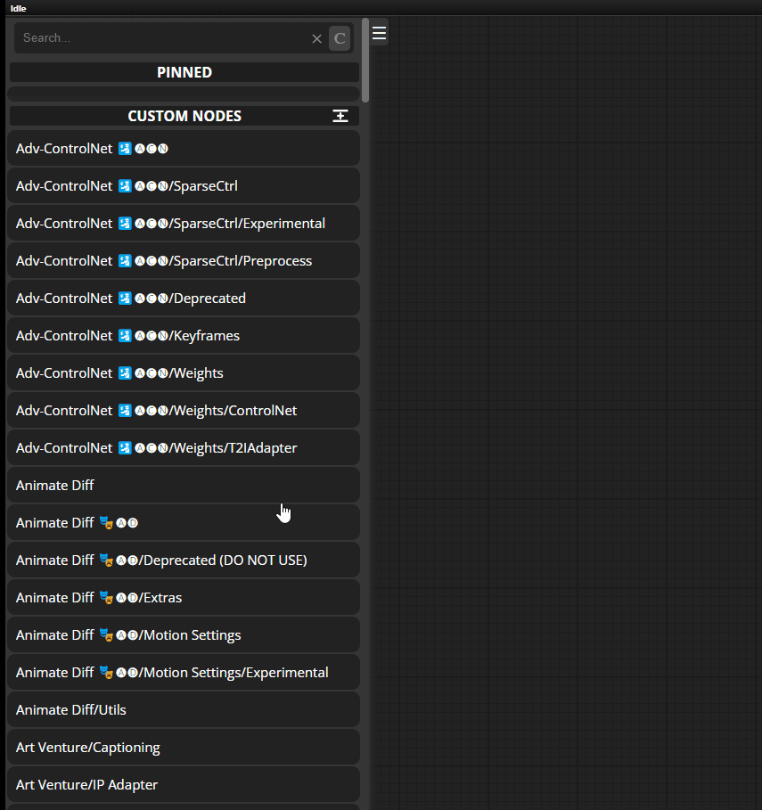

### 📌Pin Your Favorite Node📌

### 🔍Search within your nodes📄
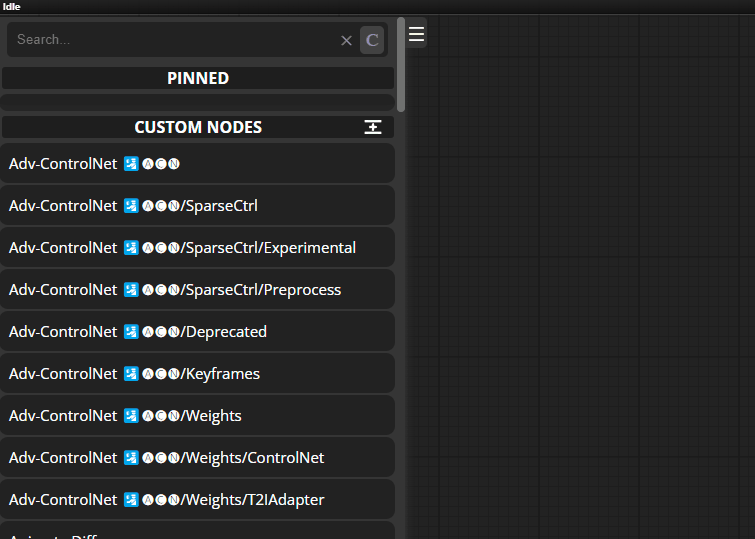

### 🔍Search within categories📂
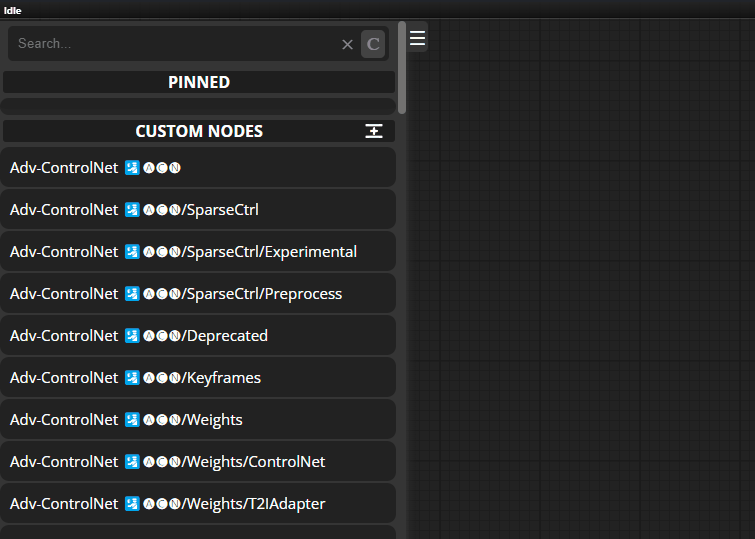

### 🔍Fuzzy Search🔄
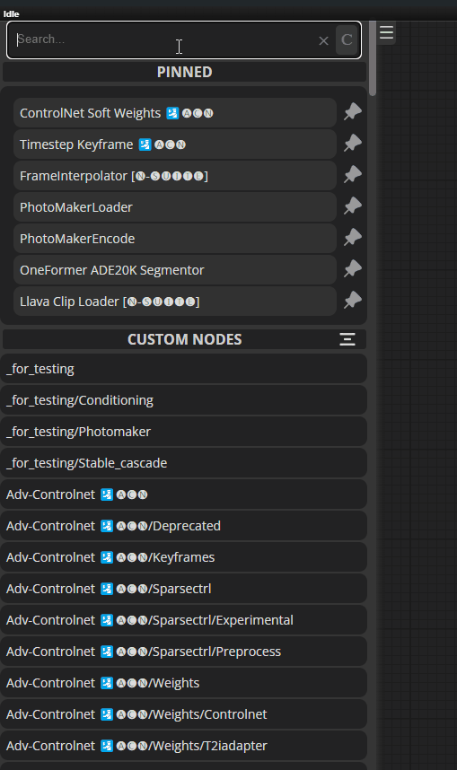
This feature is enabled by default, you can disable it in the settings. I've used fts_fuzzy_match.js by [Forrest Smith](https://github.com/forrestthewoods/lib_fts)

### 🎨 Custom Categories 📂
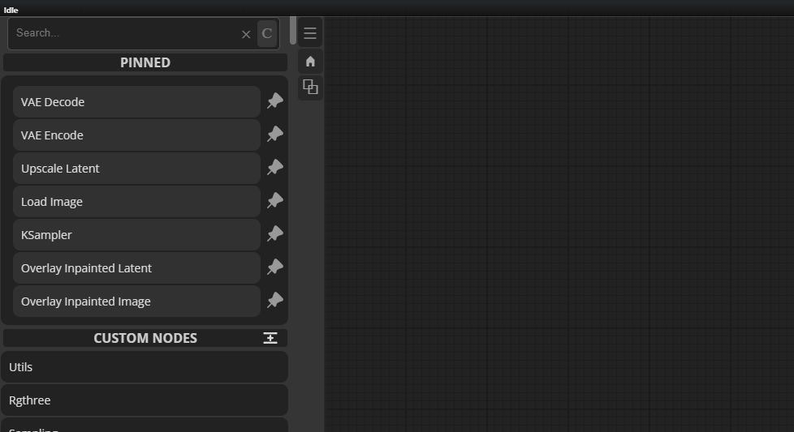

### ➕Expand/Collapse Categories/Sidebar➖
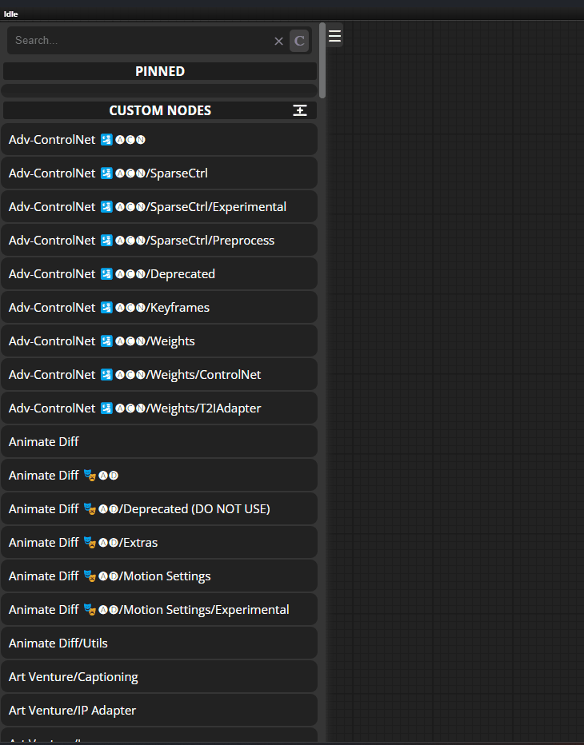

### 🔁Reorder Nodes🔁
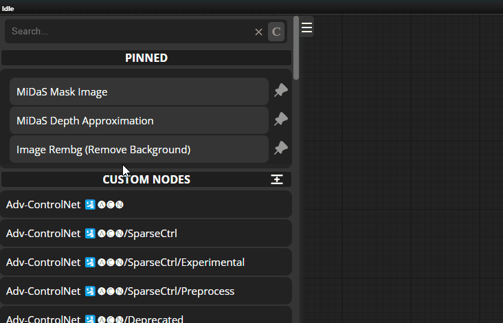
 
**Note**: The node will be placed **before** the element on which it is dragged!

### 👁 Preview Node 👁

### 📄 Templates Support 📄
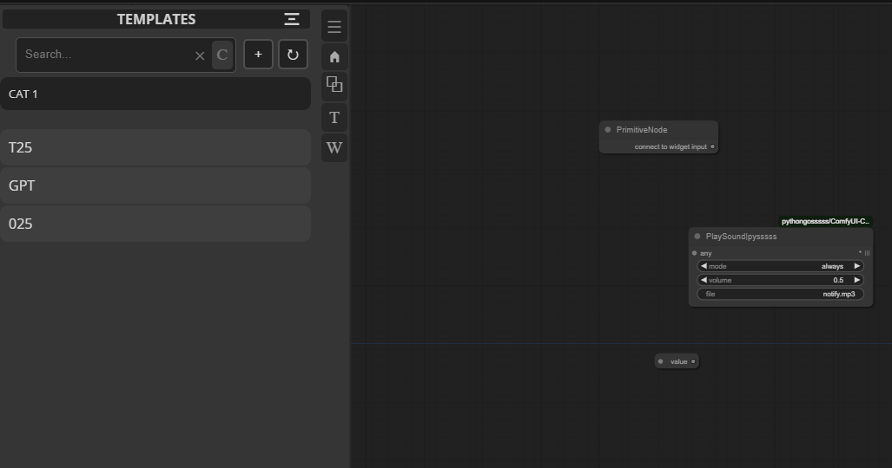

#### 📄 Workflow Support 📄
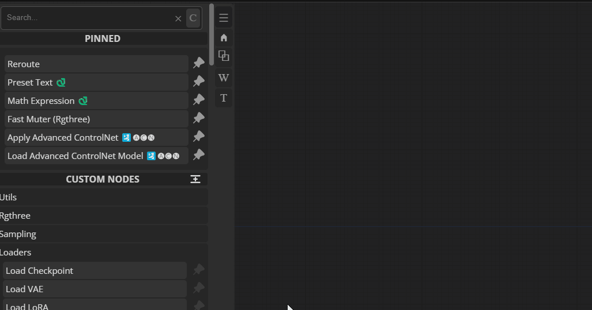

### 🎨 ComfyUI Themes Support 🎨
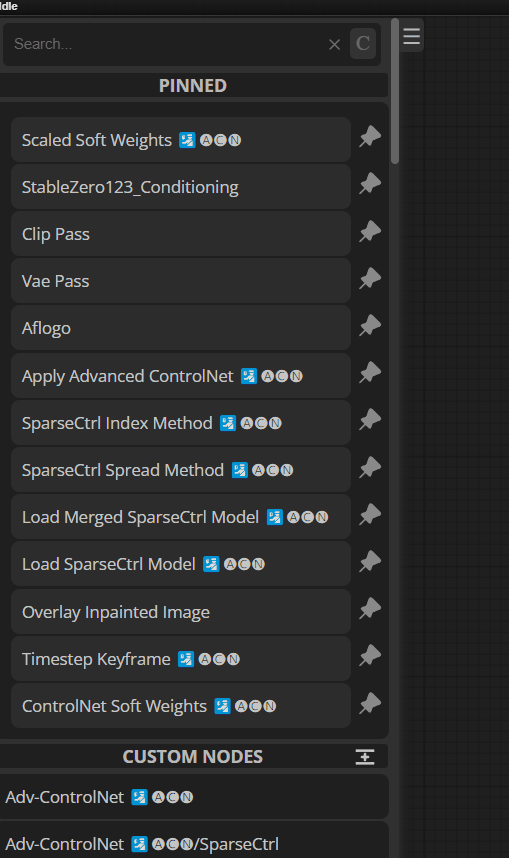

### 🎨 New Settings Panel 🎨
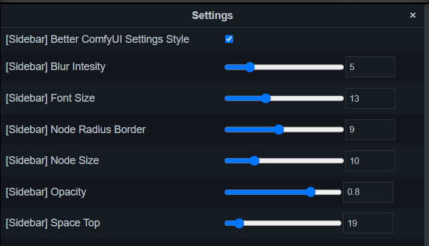

### ASSETS DOWNLOADER

This new panel allows you to download CIVITAI models (Checkpoint, TextualInversion, Hypernetwork, AestheticGradient, LORA, LoCon, DoRA, Controlnet, Upscaler, MotionModule, VAE, Poses, Wildcards, Workflows).  
The various models will be downloaded into the folders set in the settings.  
There is also the option to rebuild the "My Library" section (the dots at the top right corner):  
once the reference folders are set in the settings, by launching the rebuild, the already existing models will be identified and added to the library (if they exist in the CivitAI database).

NOTE: you can set your own API key for models that are not publicly available.

### Todo:
- [x] Reordering pinned nodes
- [x] Node preview (i don't think it will be an image)
- [x] Color integration with Jovimetrix
- [x] Better search
- [x] Custom Categories!!
- [x] Workflows
- [x] Templates
- [x] Export and Import Settings
- [x] Custom Shortcuts
- [ ] Touch Support

### Known Issues:
 - After you drag a template onto the workflow, if you drag any other file from your PC that does not include a workflow, it will paste the last template you dragged again.

## Contributing

Feel free to contribute to this project by reporting issues or suggesting improvements. Open an issue or submit a pull request on the GitHub repository.

## Donations

If you'd like to support the project, consider making a donation ❤️
 
 

## License

This project is licensed under the MIT License. See the [LICENSE](LICENSE) file for details.

